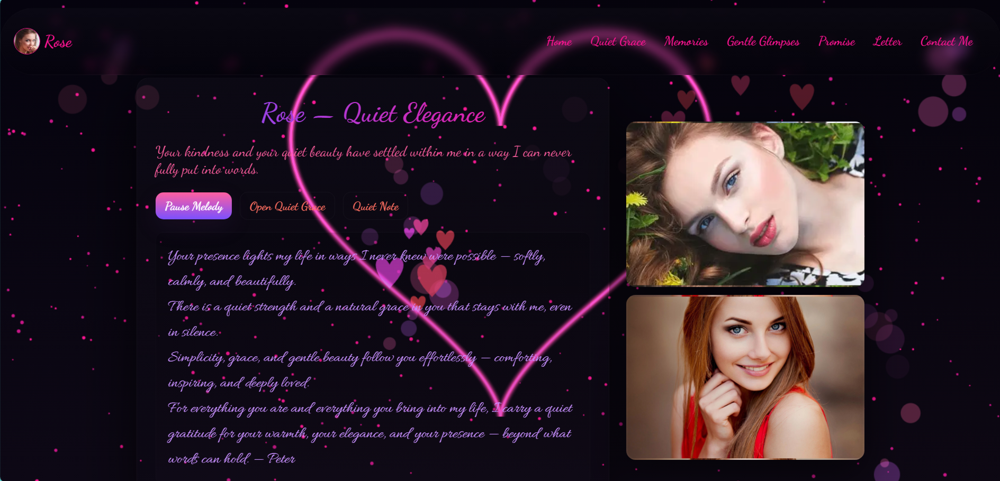
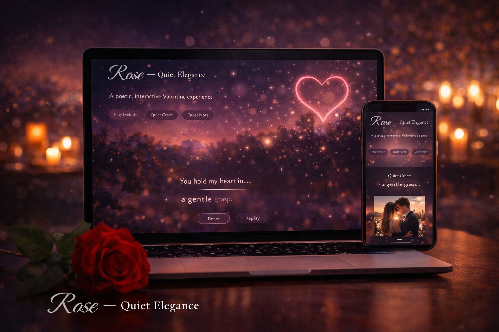

# 🌌 Rose — Quiet Elegance  
### An Immersive Poetic & Interactive Valentine Web Experience

**Rose — Quiet Elegance** is a deeply expressive, visually rich, and emotionally restrained front-end web project, thoughtfully created as a **Valentine-inspired digital experience**.

[View the website](https://rajeevtiwari8055.github.io/rose.github.io/)

This project transforms emotions into an interactive space using **motion, poetry, sound, and silence** — where every animation, glow, and transition exists for a reason.

It is not loud.  
It is not rushed.  
It is built with **stillness, respect, and emotional depth**.

---

## 📑 Table of Contents

- <a href="#project-overview">📌 Project Overview</a>  
- <a href="#valentine-intent">💝 Valentine Intent & Philosophy</a>  
- <a href="#experience-flow">🌙 Experience Flow & Sections</a>  
- <a href="#visual-design">✨ Visual & Animation Design</a>  
- <a href="#interaction">🎧 Sound, Motion & Interaction</a>  
- <a href="#technical-details">🛠️ Technical Implementation</a>  
- <a href="#accessibility">♿ Accessibility & UX Choices</a>  
- <a href="#design-principles">🎨 Design Principles Followed</a>  
- <a href="#learning-outcomes">📚 Learning Outcomes</a>  
- <a href="#how-to-run">🚀 How to Run</a>  
- <a href="#future-enhancements">🌱 Future Enhancements</a>
- <a href="#use-cases">📂 Use Cases</a>  
- <a href="#final-note">🖤 Final Note</a>
- <a href="#contact">📬 Connect with Me</a>    
- <a href="#project-preview">📸 Project Preview</a>

---

## <span id="project-overview">📌 Project Overview</span>

**Rose — Quiet Elegance** is not a traditional Valentine webpage.  
It is designed as a **slow, immersive emotional journey**.

The project focuses on:
- Calm pacing instead of fast transitions  
- Emotional typography instead of heavy graphics  
- Meaningful interaction instead of feature overload  

Every section unfolds gently, allowing the visitor to **feel** rather than consume.

---

## <span id="valentine-intent">💝 Valentine Intent & Philosophy</span>

This project was created around Valentine’s Day —  
but it does **not rely on symbols, clichés, or loud romance**.

Instead, it represents:
- Quiet affection  
- Emotional maturity  
- Respectful expression  
- Presence without possession  

Valentine here is treated as a **state of emotion**, not a calendar event.

---

## <span id="experience-flow">🌙 Experience Flow & Sections</span>

### 🏠 Home — First Presence
- Soft hero layout with poetic introduction  
- Gradient typography using **Dancing Script & Merriweather**  
- Calm call-to-action buttons:
  - 🎵 *Play Melody*
  - ✍️ *Quiet Grace*
  - 💌 *Quiet Note*
- Star-filled animated background creating night-sky depth  

The first screen feels like a **letter opened slowly**, not a landing page.

---

### ✍️ Quiet Grace — Typing Poem Experience
- JavaScript-powered **typewriter animation**
- Emotionally paced text reveal
- Reset and replay controls
- `aria-live` support for screen readers  

This section reflects how **silence between words** can be more powerful than speed.

---

### 🖼️ Memories — Image Slideshow
- Center-focused interactive slideshow  
- Smooth scale & depth animations  
- Previous / Next navigation  
- Cinematic shadows and borders  

Designed to feel like **memories being revisited**, not a gallery being browsed.

---

### ✨ Gentle Glimpses — Sound & Reflection
- Background audio with user controls  
- Calm scrolling marquee visuals  
- Emotionally grounded reflection text  

Audio and motion are carefully balanced so that **neither dominates the experience**.

---

### 💌 Letter & Modal Experience
- Modal overlays for personal notes and letters  
- Smooth fade-in / fade-out transitions  
- Distraction-free reading environment  

This section ensures emotional content stays **intimate and focused**.

---

## <span id="visual-design">✨ Visual & Animation Design</span>

### 🌟 Background Star System
- Three-layer twinkling star animations  
- Different opacity and timing cycles  
- Creates infinite depth without visual noise  

### ❤️ Canvas Effects
- Dual canvas layers:
  - Neon heart glow  
  - Floating particle system  
- Pointer-events disabled for smooth UX  
- Lightweight and performance-conscious  

Animations are continuous but never aggressive.

---

## <span id="interaction">🎧 Sound, Motion & Interaction</span>

- Music starts only with user intent  
- Buttons respond softly, not sharply  
- Hover effects remain gentle  
- Motion supports emotion — not distraction  

The interaction philosophy is **calm responsiveness**.

---

## <span id="technical-details">🛠️ Technical Implementation</span>

Built entirely with core web technologies:

- **HTML5**
  - Semantic structure  
  - ARIA labels for navigation & dynamic content  

- **CSS3**
  - Gradients & glassmorphism  
  - Keyframe animations  
  - Media queries for responsiveness  

- **Vanilla JavaScript**
  - Typing animation logic  
  - Slideshow state handling  
  - Audio & modal control  

- **Canvas API**
  - Particle effects  
  - Neon heart visuals  

No frameworks.  
No libraries.  
Everything handcrafted with intent.

---

## <span id="accessibility">♿ Accessibility & UX Choices</span>

- `aria-label` for navigation elements  
- `aria-live` for dynamic poetic text  
- Smooth scrolling behavior  
- High contrast text on dark background  
- Motion kept soft to avoid fatigue  

Accessibility is treated as **respect**, not an afterthought.

---

## <span id="design-principles">🎨 Design Principles Followed</span>

- Minimalism with emotion  
- Motion with meaning  
- Silence as a design element  
- Readability over decoration  
- Calm visuals over visual noise  

Every design decision supports **emotional clarity**.

---

## <span id="learning-outcomes">📚 Learning Outcomes</span>

Through this project, I explored:

- Emotion-driven UI/UX design  
- Advanced CSS animation control  
- Canvas-based visual effects  
- Audio integration with user consent  
- Designing interactive poetry with code  

This project strengthened both **technical skills and creative sensitivity**.

---

## <span id="how-to-run">🚀 How to Run</span>

1. Clone the repository:
   ```bash
   git clone https://github.com/rajeevtiwari8055/rose.github.io
   
2. Open index.html in any modern web browser

🎧 Use headphones for the best experience
⚡ No setup or installation required

---

## <span id="future-enhancements">🌱 Future Enhancements</span>

Planned improvements to preserve elegance while enhancing usability:

- 🌙 Soft dark / moonlight theme toggle
- ♿ Reduced-motion accessibility option
- 🎨 Canvas performance optimization
- ⌨️ Keyboard navigation improvements

These enhancements aim to make the experience more inclusive, smooth, and future-ready.

---

## <span id="use-cases">📂 Use Cases</span> 

You can use this concept in your own creative web projects too.  
It works as a portfolio piece, digital greeting card, or just a practice for pure frontend magic.

▪️ Creative coding for frontend portfolios  
▪️ Practice for CSS animations & transforms  
▪️ Digital greeting card or love letter inspiration  
▪️ Personal website micro-interaction or Easter egg  
▪️ Learning how to blend design + motion without big frameworks

---

## <span id="final-note">🖤 Final Note</span>

This project is built on a simple belief:

- Code doesn’t always need to be loud to be powerful.
- Sometimes, it just needs to be honest.

If this experience resonated with you, feel free to ⭐ star the repository.
Created with patience, respect, and quiet intention.

---

## <span id="contact">📬 Connect with Me</span>  

<!-- Typing Animation / 🤝 Connect with me -->
[](https://git.io/typing-svg)

<div align="center">
<!-- 💼 LinkedIn -->
<a href="https://www.linkedin.com/in/rajeevtiwari8055"></a>
<!-- 📮 Gmail -->
<a href="mailto:rajeevtiwari8055@gmail.com" target="_blank"></a>
<!-- ✖️ X -->
<a href="https://x.com/rajeevtiwariRT" target="_blank"></a>  
<!-- 🆔 GitHub -->
<a href="https://github.com/rajeevtiwari8055" target="_blank"></a>
<!-- 🌐 Website -->
<a href="https://rajeevtiwari8055.github.io/" target="_blank"></a>
</div>

<!-- Typing Animation / 🤝 Thanks for Visiting! -->
[](https://git.io/typing-svg)

<!-- ⭐💫 Shower stars if you like my repos -->
<div align="center">

<a href="https://github.com/rajeevtiwari8055/rajeevtiwari8055" alt="GitHub Stars" title="Star my repositories">

</a>
</div>

---

## <span id="project-preview">📸 Project Preview</span> 

🖼️ *Love Forever* – `Rose — Quiet Elegance`


🖼️ *Dynamic Visual* – `Canvas Effects & Ambient Motion`



🖼️ *Alternate Visual* – `Typing Poem & Interactive Sections`



---


